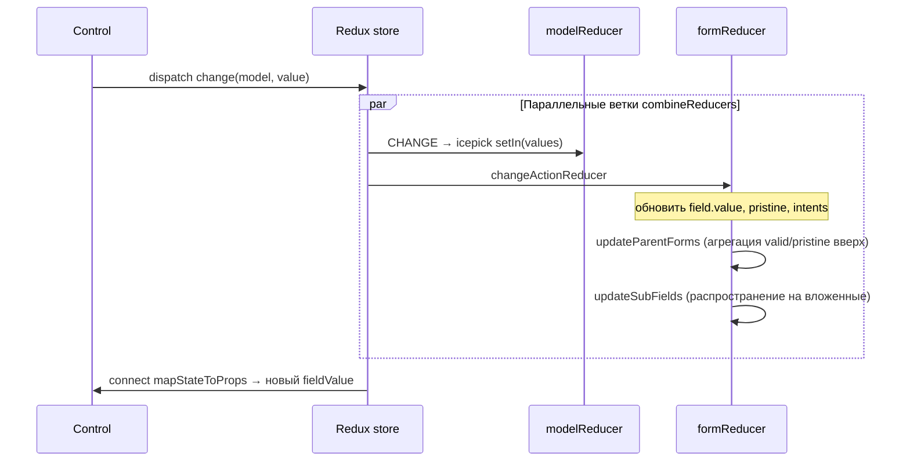

# Архитектура react-redux-form

## Модель данных: «значение + мета»

RRF хранит в Redux **параллельные деревья**:

1. **Model reducer** — «плоские» бизнес-значения (`state.forms.PAYMENT_ORDER.AMOUNT`).
2. **Form reducer** — зеркало с метаданными полей (`state.forms.forms.PAYMENT_ORDER.AMOUNT.{ value, valid, touched, … }`).

Корень формы помечен объектом `$form`:

```js
{
  $form: { model: 'forms.PAYMENT_ORDER', value: { ... }, valid, pristine, ... },
  AMOUNT: { model: 'forms.PAYMENT_ORDER.AMOUNT', value: '100', valid: true, ... },
  // вложенные формы / массивы — снова $form на узлах-массивах/объектах
}
```

Создание начального дерева — `createFormState` в `src/utils/create-field.js`: для каждого ключа начального объекта рекурсивно создаётся field/form state (**eager**, если не `options.lazy`).

## Точка входа (`src/index.js`)

| Экспорт | Назначение |
|---------|------------|
| `combineForms`, `createForms` | Регистрация множества форм в одном `combineReducers` |
| `formReducer`, `modelReducer` | Низкоуровневые редьюсеры одной формы |
| `Form`, `LocalForm` | Обёртка `<form>`, submit, reset, валидаторы уровня формы |
| `Control` | Связка input ↔ model (основной UI-примитив) |
| `Field`, `Fieldset`, `Errors` | Альтернативные обёртки (в СББОЛ почти не используются) |
| `actions`, `actionTypes` | Imperative API (`change`, `load`, `setErrors`, …) |
| `form` (selector) | Хелперы `isValid`, `isPristine`, … |
| `track`, `getField`, `getModel` | Утилиты |

## `combineForms` — сердце регистрации

`src/reducers/forms-reducer.js`:

- На каждый ключ в объекте форм создаётся **model reducer** (`modelReducer` или `modeled(customReducer)`).
- Один общий **form reducer** под ключом `forms` (по умолчанию) с `initialFormState` из всех форм.

```js
combineForms({ APPL…: initialState, … }, 'forms')
// → {
//   APPL…: modelReducer,
//   PAYMENT_ORDER: modelReducer,
//   forms: formReducer('forms', { APPL…: tree, … })
// }
```

Префикс модели (`'forms'`) попадает в `action.model` как `forms.PAYMENT_ORDER.AMOUNT`.

## Поток действия `change`



Ключевые файлы:

- `src/reducers/form/change-action-reducer.js` — смена value, сброс `validated`, `intents`.
- `src/utils/update-parent-forms.js` — пересчёт `$form` родителей (icepick `merge`).
- `src/utils/update-sub-fields.js` — каскад `validated`/`retouched` на дочерние поля формы.

**Стоимость:** изменение одного листового поля может пройти цепочку обновлений вверх и вниз по дереву формы — O(глубина + число потомков с `$form`).

## Form reducer: плагины и batch

`createFormReducer` оборачивает цепочку плагинов:

1. Пользовательские `plugins` из options.
2. `changeActionReducer`.
3. `createFormActionsReducer` (blur, focus, setTouched, setErrors, resetValidity, …).

Внешняя оболочка — `createBatchReducer`: action `rrf/batch` сворачивает массив actions в один проход reducer (меньше промежуточных immutable-копий).

## Компонент `Control`

Фабрика: `src/components/control-component-factory.js` (~950 строк).

- `connect(mapStateToProps)` — на каждый control: `getFieldFromState`, `get(state, model)`.
- `shallowEqual` / `deepKeys: ['controlProps']` в `areStatePropsEqual`.
- События: `updateOn`, `validateOn`, `debounce`, `parser`, `formatter`.
- Валидация: локальные `validators` / `errors` → `setErrors` / `clearIntents`.
- **ref callback** (`getControlRef`) для DOM-узла и HTML5 constraint validation (`willValidate`); `findDOMNode` удалён.

СББОЛ не использует `<Control>` напрямую в JSX — только через `wrapWithFormControl` → `component={Input}`.

## Компонент `Form`

`src/components/form-component.js`:

- Context: `model` для дочерних Field/Control.
- Submit: валидаторы формы, `setSubmitted`, `handleValidSubmit` / `handleInvalidSubmit`.
- `componentDidMount`: `clearGetFormCacheForModel(model)` + опциональная валидация на `change`.

В СББОЛ: `<Form model={…}>` в `Document.jsx`, модалках, фильтрах.

## Поиск формы по model string: `getForm`

`src/utils/get-form.js`:

- Рекурсивный обход дерева `state.forms.forms` по ключам с `$form`.
- **Модульный кэш** `formStateKeyCache[modelString]` → путь к форме.
- API: `clearGetFormCache()`, `clearGetFormCacheForModel(model)`.

Используется в `getFieldFromState` — на **каждый** resolve поля. При стабильной структуре форм кэш эффективен; при динамическом добавлении форм без очистки — риск устаревшего пути (см. PR #1218).

## Actions (imperative API)

Префикс типов: `rrf/*` (`src/action-types.js`).

Часто используемые в СББОЛ:

| Action | Назначение |
|--------|------------|
| `change` | Значение поля |
| `merge` | Частичное обновление объекта формы |
| `load` | Загрузка документа (часто + silent) |
| `reset` / `resetValidity` | Сброс |
| `setErrors`, `setFieldsValidity` | Серверные / логические ошибки |
| `setTouched`, `setDirty`, `setSubmitted` | UX-состояние |
| `batch` | Группировка |

## `modeled` enhancer

`src/enhancers/modeled-enhancer.js` — оборачивает **кастомный** document reducer:

```js
state => customReducer(modelReducer(state), action)
```

Позволяет совместить доменную логику документа с синхронизацией model slice. В СББОЛ большинство форм — plain `initialState` object, не function reducer.

## Immutable-ветка

`src/immutable.js` + `get-from-immutable-state` — отдельная стратегия для Immutable.js. **СББОЛ не использует.**

## Android

`src/android.js` — legacy. Для веб-клиента не релевантно.

## Размер и границы ответственности

- ~170 исходных файлов в `src/`, из них ~50 утилит.
- Библиотека **не** занимается: сетевыми запросами, схемой API, UI-компонентами — это слой приложения (СББОЛ: `acControls`, format controls, `upsert`).
